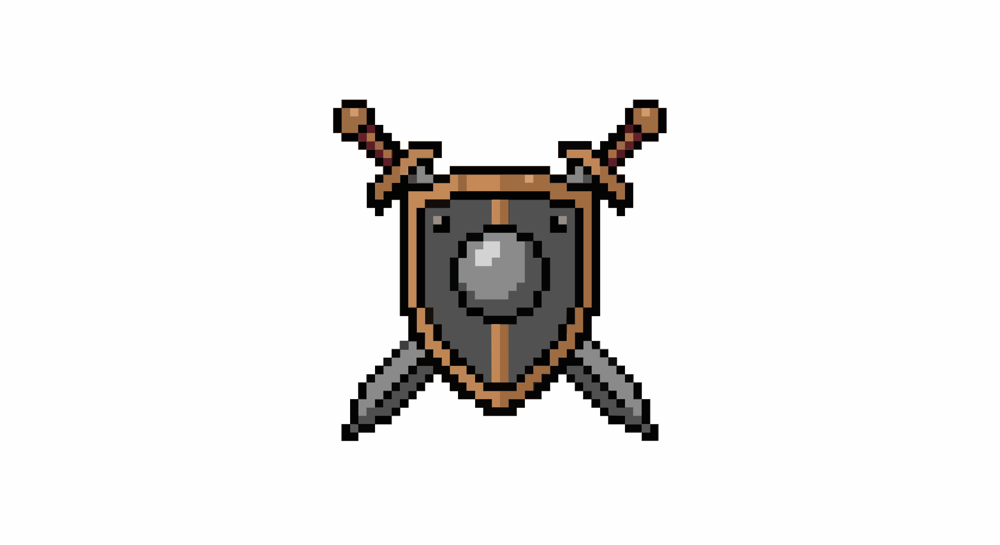

<div align="center">



# 弹球角斗场
### Pinball Arena

[](https://github.com/xixicc186/pinball-arena/stargazers)
[](https://github.com/xixicc186/pinball-arena/commits/main)
[](https://github.com/xixicc186/pinball-arena/issues)
[](https://github.com/xixicc186/pinball-arena/pulls)
[](https://github.com/xixicc186/pinball-arena/graphs/contributors)
[](./AGENT.md)
[]()

纯静态浏览器弹球对战游戏 · 16 名角色 · 赛事录制 · Agent 全自动运营

[在线游玩](https://xixicc186.github.io/pinball-arena/) · [Agent 指南](./AGENT.md) · [查看角色](./src/characters.js)

</div>

---

## 启动

在项目根目录启动静态服务器：

```bash
python -m http.server 8080
```

然后访问 `http://localhost:8080`。

---

## 数据库配置（可选）

游戏本体**无需数据库即可正常运行**。`src/db.js` 中的 Supabase 集成仅用于在线保存角色调参数据（编辑器面板的数值覆盖）。如不需要此功能，可忽略本节。

### 配置步骤

1. 在 [supabase.com](https://supabase.com) 创建一个免费项目
2. 进入 **Project Settings → API**，复制：
   - **Project URL**
   - **Project API Keys → anon public**
3. 打开 `src/db.js`，将顶部占位符替换为你的值：

```js
const SUPABASE_URL = "https://你的项目ID.supabase.co";
const SUPABASE_KEY = "你的 anon public key";
```

4. 在 Supabase **SQL Editor** 中执行以下语句建表：

```sql
-- 角色调参覆盖表
create table character_tuning (
  character_id text primary key,
  overrides    jsonb,
  updated_at   timestamptz default now()
);

-- 角色出场介绍文字表
create table character_intro (
  character_id       text primary key,
  name               text,
  title              text,
  description        text,
  basic_attack_name  text,
  ultimate_name      text,
  updated_at         timestamptz default now()
);

-- 开启 Row Level Security（推荐）
alter table character_tuning enable row level security;
alter table character_intro  enable row level security;

-- 允许匿名用户读写（根据需要收紧权限）
create policy "public read"  on character_tuning for select using (true);
create policy "public write" on character_tuning for all    using (true) with check (true);
create policy "public read"  on character_intro  for select using (true);
create policy "public write" on character_intro  for all    using (true) with check (true);
```

---

## 接入新角色完整指南

### 一、必须修改：`src/characters.js`

在 `CHARACTER_LIBRARY` 数组末尾用 `defineCharacter({...})` 定义角色：

```js
defineCharacter({
  id: "my-char",           // 唯一 kebab-case ID
  name: "角色名",
  title: "称号",
  color: "#ff8844",        // 主题色，用于 UI、粒子、光晕
  description: "能力描述",

  stats: {
    maxHp: 120,            // 生命值
    speed: 180,            // 移动速度（像素/秒，世界坐标）
    maxEssence: 3,         // 大招所需精元数
    attackRange: 200,      // 仅影响 proximity 触发器的感知范围
    radius: 18,            // 碰撞半径（世界坐标，典型值 14-22）
  },

  // 可选：可在编辑器面板里调整的参数
  tuning: {
    basic: { cooldown: 1.2, damage: 15 },
    ult:   { radius: 200, damage: 40 },
  },

  // 对应 tuning 的编辑器字段（可省略）
  editorSections: [
    {
      title: "平A参数",
      fields: [
        editableField("tuning.basic.cooldown", "冷却时间", { min: 0.1, step: 0.1, unit: "s" }),
        editableField("tuning.basic.damage",   "伤害",     { min: 1,   step: 1 }),
      ],
    },
  ],

  // 生成时初始化自定义状态
  onSpawn({ actor, api, game }) {
    actor.state.myCounter = 0;
  },

  // 可选：击杀回调
  onKill({ actor, target, api, game }) { },

  // 可选：死亡回调
  onDeath({ actor, attacker, api, game }) { },

  // 可选：场上任意角色死亡时触发（招魂者引入的钩子）
  onAnyDeath({ actor, dead, attacker, api, game }) { },

  basicAttack: {
    name: "平A技能名",
    // 可叠加多个触发器
    triggers: [
      { type: "interval",    interval: 1.2 },          // 每隔 N 秒
      { type: "collision",   cooldown: 0.5 },          // 碰撞敌人
      { type: "onWallBounce",cooldown: 0.8 },          // 撞墙
      { type: "trail",       interval: 0.3 },          // 移动轨迹
      { type: "proximity",   radius: 150 },            // 范围内有敌人时
    ],
    execute({ actor, api, event, enemies, game }) {
      // event: collision/wallBounce 事件对象（其他触发器为 null）
      // enemies: 当前存活敌人数组
      api.spawnProjectile({
        direction: actor.velocity,   // 方向向量（会自动归一化）
        speed: 320,
        radius: 6,
        damage: 15,
        color: actor.definition.color,
        lifetime: 2,                 // 秒
        bounces: 2,                  // 最多弹墙次数
        knockback: 60,
        pierce: false,               // 穿透
      });
    },
  },

  ultimate: {
    name: "大招名",
    execute({ actor, api, enemies, game }) {
      api.spawnPulse({
        radius: 180,
        damage: 35,
        color: actor.definition.color,
        knockback: 120,
        shake: 8,
      });
    },
  },
});
```

---

### 二、API 方法速查（`execute` 内可用）

| 方法 | 说明 |
|------|------|
| `api.spawnProjectile({...})` | 发射抛射物（支持 `bounces`/`pierce`/`frostConfig`/`shape`/`length`） |
| `api.spawnPulse({...})` | 范围脉冲伤害 |
| `api.createTrail({...})` | 在当前位置留下地面效果（毒/减速） |
| `api.explodeOwnedTrails({...})` | 引爆自己留下的所有轨迹 |
| `api.spawnStrike({position, delay, radius, damage, color, strikeType})` | 延迟落雷 |
| `api.spawnLaser({direction, maxBounces, damage, stunDuration, color, width, lifetime, persistent})` | 发射激光 |
| `api.summonTurret({maxCount, radius, fireInterval, damage, range, maxHits, color, projectileColor})` | 召唤炮台 |
| `api.upgradeTurrets({...})` | 升级现有炮台 |
| `api.dealDamage(target, amount, options)` | 直接扣血（`options.ignoreInvulnerable: true` 穿透无敌） |
| `api.heal(amount)` | 自身回血 |
| `api.shake(amount, duration)` | 屏幕震动 |
| `api.emitText(text, position, color)` | 浮动文字 |
| `api.schedule(delay, callback)` | 延迟执行（callback 接收 `{actor,api,game}`） |
| `api.lockMovement(duration)` | 锁定移动 |
| `api.grantInvulnerable(duration)` | 无敌帧 |
| `api.setRadiusScale(scale, duration)` | 临时改变碰撞半径倍率 |
| `api.setSpeedMultiplier(multiplier, duration)` | 临时改变速度倍率 |
| `api.forceChase(target, duration, strength)` | 强制追踪目标 |
| `api.createDrainBeam({targetId, duration, color})` | 吸血连接光束 |
| `api.spawnDecoy({maxCount, maxHits, explodeDamage, explodeRadius})` | 召唤分身 |
| `api.activateDecoys({activateDamage})` | 引爆分身 |
| `api.applyFrost(target, options)` | 施加冰霜层 |
| `api.forceFreezeTarget(target, duration)` | 强制冻结目标 |
| `api.findNearestEnemy(range)` | 查找最近敌人 |
| `api.findLowestHpEnemy()` | 查找血量最低敌人 |
| `api.directionTo(target)` | 朝向目标的单位向量 |
| `api.normalize(vec)` | 向量归一化 |
| `api.distance(a, b)` | 两点距离 |
| `api.announce(message)` | 全场公告 |
| `api.isPoisoned(target)` | 目标是否中毒 |

---

### 三、按需修改：`src/game.js`

大多数角色**只需改 characters.js**，以下情况才需要动 game.js：

#### 情况 A：自定义球体外观

在 `renderActorBody()` 的 switch 里加 case（约 line 2370）：

```js
case "my-char":
  this.renderMyCharBall(ctx, actor, elapsed);
  break;
```

然后实现渲染方法：

```js
renderMyCharBall(ctx, actor, elapsed) {
  const { x, y } = actor.position;
  const r = actor.radius;
  // 用标准 canvas 2D API 绘制，坐标系为 world 单位
}
```

#### 情况 B：持续更新逻辑（环绕物、持续光束等）

1. 实现 `updateMyChar(dt)` 方法
2. 在 `tick()` 适当位置插入调用（约 line 490）
3. 如有附加渲染，在 `renderActors()` 的 `renderActorBody()` 调用后按 `characterId` 插入（约 line 2294）

#### 情况 C：无特殊外观 / 纯 characters.js 角色

不需要改 game.js，直接提交即可。

---

### 四、必须修改：`src/sounds.js`

每个角色**必须**在两处添加音效函数：

```js
// 1. basicAttackSounds 对象（约 line 108）——用 throttle 防连触
"my-char": throttle("ba:my-char", 120, (ctx, { impactSpeed }) => {
  // 用 Web Audio API 合成音效
  const osc = ctx.createOscillator();
  // ...
}),

// 2. ultimateSounds 对象（约 line 296）——无需限流
"my-char"(ctx) {
  // 大招音效
},
```

---

### 五、接入 Checklist

- [ ] `characters.js`：添加 `defineCharacter({...})` 到 `CHARACTER_LIBRARY`
- [ ] `sounds.js`：添加 `basicAttackSounds["my-char"]` 和 `ultimateSounds["my-char"]`
- [ ] `game.js`（可选）：自定义外观 → `renderActorBody()` switch + 渲染方法
- [ ] `game.js`（可选）：持续系统 → `updateMyChar()` + 在 `tick()` 里调用
- [ ] `game.js`（可选）：附加渲染 → `renderActors()` 内按 `characterId` 插入

---

## 已有角色（16 个）

| ID | 名称 | 技能特色 |
|----|------|---------|
| `bee-stinger` | 蜂刺 | 追踪光针 |
| `plague-mist` | 瘟疫 | 尾迹毒液 |
| `meat-grinder` | 绞肉机 | 近战碰撞 |
| `storm-magnet` | 磁暴 | 撞墙放电弧 |
| `turret-smith` | 炮台 | 部署炮台 |
| `bomber-rex` | 轰炸机 | 榴弹轰炸 |
| `blood-leech` | 汲取者 | 吸血锁链 |
| `phantom-mirror` | 分身师 | 爆炸分身 |
| `holy-shield` | 盾狗 | 充能护甲 + 环绕圣剑 |
| `frost-core` | 绝对零度 | 冰刺叠层冻结 |
| `prism-refract` | 棱镜 | 激光反弹 |
| `storm-weather` | 风暴·气象台 | 龙卷风捕获 + 缴械 |
| `eagle-eye` | 鹰眼·狙击手 | 瞄准线 + 隐身 |
| `soul-caller` | 招魂者·亡灵巫师 | 生成幽灵 + 大招穿透引爆 |
| `gambler-wheel` | 赌徒·轮盘 | 随机轮盘效果 |
| `mirror-mimic` | 幻镜·替身使者 | 拟态转移伤害 |

---

## 核心文件

| 文件 | 职责 |
|------|------|
| `index.html` | 页面结构与 UI 入口 |
| `styles.css` | 界面样式 |
| `src/main.js` | 角色选择、HUD、录制、赛事逻辑 |
| `src/game.js` | 物理、竞技场、战斗、技能 API（约 3700 行） |
| `src/characters.js` | 角色库与能力定义 |
| `src/sounds.js` | Web Audio 合成音效 |
| `src/db.js` | Supabase 数据库接口（可选，见数据库配置章节） |

---

## Agent 自动化

本项目支持 AI Agent 全自动运营：设计角色 → 接入游戏 → 录制赛事视频 → 发布到自媒体平台。

详见 **[AGENT.md](./AGENT.md)**，包含：
- CDP 浏览器自动化接口（角色选择、触发录制）
- 角色设计与代码生成规范
- 视频产物格式与下载拦截方法
- 抖音 / B站 / YouTube 发布接入点

---

## Agent 实战速查

这一节给“接手项目的其他 Agent”用，目标是最快完成用户常见任务：选角色、开打、录制、导出视频。

### 先判断用户要哪种玩法

| 任务类型 | UI 模式 | 人数要求 | 录制按钮 |
|------|------|------|------|
| 自由混战单局 | `自由混战` | 至少 2 名角色 | `录制对局` |
| 个人战赛事 | `赛事玩法` + `个人战` | 恰好 8 名角色 | `录制整届赛事` |
| 组队赛赛事 | `赛事玩法` + `组队赛` | 恰好 16 名角色 | `录制整届赛事` |

### 当前版本的重要前提

- 默认打开页面时，**所有角色都是“不出战”**
- Agent 必须先进入“角色选择与编辑”面板，再明确勾选参赛角色
- 如果用户没有指定完整阵容，Agent 需要自己补齐人数，并说明选择依据

### 推荐执行步骤

1. 启动本地静态服务，打开 `http://localhost:8080`
2. 根据任务类型切换到 `自由混战` 或 `赛事玩法`
3. 点击 `角色选择与编辑`
4. 先确认 roster 是否为空；当前版本默认应为全员“不出战”
5. 按任务要求勾选角色
6. 如果是赛事玩法，再切换 `组队赛` 或 `个人战`
7. 点击对应录制按钮，等待比赛自动结束
8. 录制结束后，处理浏览器确认框：
   - 第一个确认框：选择“是”，导出视频
   - 第二个确认框：如果用户要 MP4，选择“是”
9. 如果浏览器把文件下载到默认下载目录，再移动到项目根目录或用户指定目录

### Agent 选角时要同时考虑的因素

- 玩法模式：自由混战、个人战、组队赛的人数要求不同
- 观赏性：优先选择激光、龙卷风、毒雾、分身、招魂这类高特效角色
- 平衡性：避免极端碾压，尽量让视频里有拉扯和反转
- 节奏：短视频更适合中前期就有明显爆点的角色组合
- 角色相性：注意克制、联动、混战混乱度，不要只看单卡强度
- 视频长度：团队赛更长，单局更适合快速出片

### 一个可直接照抄的任务模板

当用户说“帮我选一组角色，录一场团队赛，导出到项目根目录”时，Agent 应按这个顺序执行：

1. 判断这是 `赛事玩法 + 组队赛`
2. 准备恰好 16 名角色
3. 打开角色面板，逐个标记为“出战”
4. 点击 `录制整届赛事`
5. 等待整届比赛打完
6. 确认导出视频
7. 如用户要 MP4，则继续确认 MP4 转换
8. 把最终视频放到项目根目录
